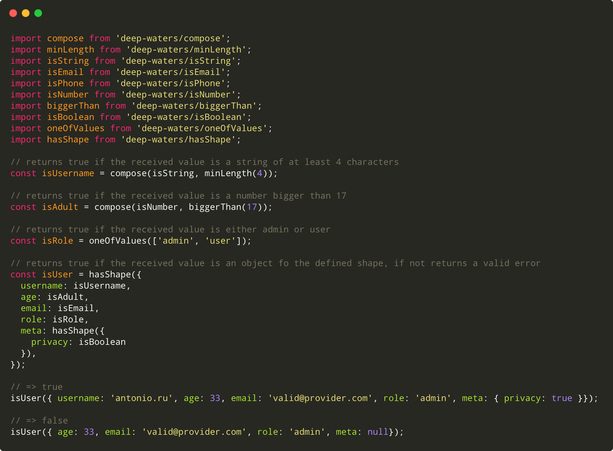

# Deep waters

<div align="center">
  <p align="center">
    
  </p>
</div>
<div>
  <h3 align="center">
    a lightweight functional javascript validation system
  </h3>
</div>



## 💡 What is this?

`deep-waters` is an easy-to-compose javascript validation system. 
It allows developers to easily create custom and reusable validators from the pre-existing ones by using a functional 
approach and the composition principle.

## ☕️ Features

* Full functional
* Small and lightweight
* Concise API
* Modular functions


## 🕺 Install

`deep-waters` works both on client and server side

by using `npm`:
```bash
$ npm install deep-waters
```

by using `yarn`:

```bash
$ yarn add deep-waters
```

Icon made by [Freepik](https://www.flaticon.com/authors/freepik) from [www.flaticon.com](https://www.flaticon.com/free-icon/hook_1081812)
